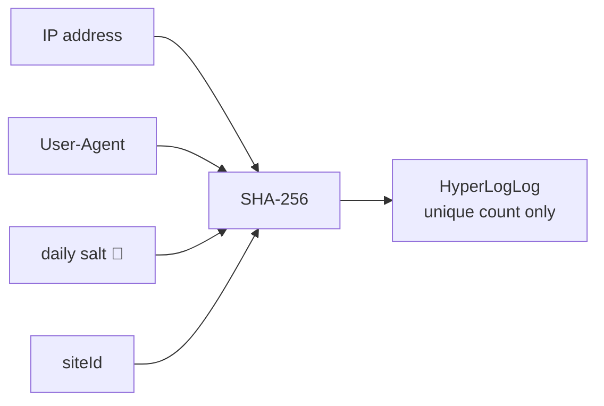

# Effimero

[](LICENSE)

Privacy-first web analytics: no cookies, no localStorage, no fingerprinting, no consent banner needed.

## Philosophy

Effimero is free and open source, with no cloud plan and no premium tier. You self-host it, you own your data, and the AGPL-3.0 guarantees the whole stack stays open: anyone may offer Effimero hosting to others, provided their modifications remain open too. Privacy comes from the algorithm, not from a policy page, and the same applies to freedom: it comes from the license, not from a promise.

## How it works

Unique visitors are counted with a **daily rotating salted hash**:

```
visitorHash = SHA-256(IP | User-Agent | dailySalt | siteId)
```



- The salt is random, generated once per UTC day, kept only in Redis, and never logged. When it rotates, yesterday's hashes become uncorrelatable with today's, so cross-day tracking is impossible **by construction**, not by policy.
- The raw IP is used only in memory to compute the hash and is never stored.
- Hashes are fed into a Redis **HyperLogLog**, so not even the hash itself is stored verbatim, only a probabilistic cardinality sketch (~0.81% standard error).
- Nothing is written on the visitor's device.

### Known trade-offs (by design)

- No returning-visitor or cross-day unique metrics.
- No multi-touch attribution or session stitching.
- Visitors sharing IP + identical User-Agent within a day count as one.
- Unique counts are probabilistic (HyperLogLog).

## Quick start (self-hosted)

```sh
cp .env.sample .env
docker compose up -d
```

Register the site before collecting hits — `/collect` silently ignores any
`siteId` that is not registered, so unknown sites can no longer inject stats.
Registration returns a **per-site read token**, shown only once:

```sh
curl -X POST https://your-host/admin/sites \
     -H "Authorization: Bearer <STATS_API_KEY>" \
     -H "Content-Type: application/json" \
     -d '{"siteId":"my-site","allowedOrigins":["https://my-site.com"]}'
# → { "siteId": "my-site", ..., "readToken": "…store-this-now…" }
```

`allowedOrigins` restricts which origins may record hits for the site: a hit is
kept only if its request `Origin` matches an entry. Leave it empty (or omit it)
to accept any origin. Update it later without rotating the token:

```sh
curl -X PATCH https://your-host/admin/sites/my-site \
     -H "Authorization: Bearer <STATS_API_KEY>" \
     -H "Content-Type: application/json" \
     -d '{"allowedOrigins":["https://my-site.com","https://www.my-site.com"]}'
```

Then add the snippet to your site:

```html
<script src="https://your-host/effimero.js"
        data-site="my-site"
        data-endpoint="https://your-host/collect" defer></script>
```

### Reading stats: two credential levels

- The **`STATS_API_KEY`** (admin) reads every site and manages the registry.
- A **per-site read token** reads only its own site — hand this to a client so they can see their data and nothing else. Rotate it with `POST /admin/sites/my-site/token`.

View stats through the dashboard at `https://your-host/`. It accepts either credential; set `STATS_API_KEY` in `.env`, or retrieve the generated key from the server logs if you left it empty:

```sh
docker compose logs effimero | grep generated
```

You can also query the API directly with either credential:

```sh
curl https://your-host/stats/my-site?range=30 -H "Authorization: Bearer <token-or-admin-key>"
```

A site token is rejected (`403`) for any site other than its own.

## Development

```sh
pnpm install
docker run -d -p 6379:6379 redis:7-alpine   # or your own Redis
pnpm --filter @effimero/server dev            # API on :3000
pnpm --filter @effimero/dashboard dev         # dashboard on :5173 (proxies /stats)
pnpm --filter @effimero/snippet build         # builds dist/effimero.js
```

## Configuration (env vars)

| Variable | Default | Description |
|---|---|---|
| `PORT` | `3000` | HTTP port |
| `REDIS_URL` | `redis://localhost:6379` | Redis connection |
| `ALLOWED_ORIGINS` | `*` | Comma-separated CORS origins (global response headers). Per-site ingest restriction is configured per site via `allowedOrigins`, not here |
| `TRUST_PROXY` | `false` | Set `true` behind a reverse proxy so the real client IP is read from `X-Forwarded-For` |
| `RETENTION_DAYS` | `90` | Days of aggregate stats kept in Redis |
| `COLLECT_RATE_LIMIT` | `120` | Max `/collect` hits per client IP per window. `0` disables rate limiting |
| `COLLECT_RATE_WINDOW` | `60` | Rate-limit window in seconds |
| `MAX_DISTINCT_PATHS` | `2000` | Max distinct paths tracked per site/day; extras fold into `__other__` (bounds Redis memory) |
| `MAX_DISTINCT_REFERRERS` | `2000` | Max distinct referrers tracked per site/day; extras fold into `__other__` |
| `STATS_API_KEY` | auto-generated | **Admin** bearer key: manages the site registry (`/admin/*`) and reads every site (`/stats`, `/live`, `/sites`). Per-site read tokens (issued at registration) grant read access to a single site. Set it in `.env` to keep access stable across restarts. Empty/unset: a random key is generated and logged at boot. `disabled`: all endpoints are public |

Numeric variables must be integers. `PORT`, `RETENTION_DAYS`, and `COLLECT_RATE_WINDOW` must be positive; rate and cardinality limits may be zero. Invalid values stop the server at startup.

> **Important:** if Effimero runs behind nginx/Caddy/Traefik, set `TRUST_PROXY=true`, otherwise every visitor appears to come from the proxy's IP and unique counts collapse to ~1.

## Repository layout

- `apps/server`: Fastify ingest + stats API
- `apps/dashboard`: React dashboard (uniques/day, pageviews, top pages/referrers)
- `apps/website`: static marketing/docs site
- `packages/snippet`: ~1 KB browser snippet (SPA-aware, respects DNT/GPC)
- `examples/test-site`: plain HTML test site for local hit generation

## Documentation

Full docs live in [`docs/`](docs/README.md): [getting started](docs/getting-started.md), [self-hosting](docs/self-hosting.md), [API reference](docs/api.md) (interactive Swagger UI at `/docs/api`), [privacy model](docs/privacy.md), [architecture](docs/architecture.md).

## License

[AGPL-3.0-only](LICENSE). In short: use it, self-host it, modify it, even offer it as a service, but derivative work and network-served modifications must stay open source.

## Credits

Approach inspired by [Margin's blog post on tracking unique visitors without cookies](https://inmargin.io/blog/tracking-unique-visitors-without-cookies).
