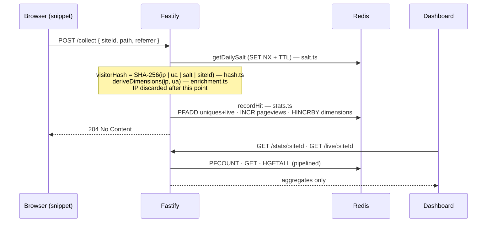

# Architecture

## Monorepo layout

```
effimero/
  packages/
    server/       Fastify API: ingest, stats, swagger, static serving
    snippet/      browser tracking script (~700 B, esbuild IIFE)
    dashboard/    React cockpit dashboard (Vite)
    website/      static presentation site
    test-site/    plain HTML pages for local hit generation
  docs/           this documentation
  Dockerfile      multi-stage build: server + snippet + dashboard in one image
  docker-compose.yml
```

pnpm workspaces; TypeScript everywhere except the static HTML packages.

## Data flow



## Module responsibilities (server)

| Module | Responsibility | Depends on |
|---|---|---|
| `config.ts` | environment parsing, one place | nothing |
| `salt.ts` | daily salt lifecycle, atomic creation | Redis |
| `hash.ts` | pure hash function | node:crypto |
| `enrichment.ts` | UA/geo/language to coarse buckets | ua-parser-js, geoip-lite |
| `stats.ts` | write and read aggregate structures | Redis |
| `schemas.ts` | request/response JSON Schemas, feeds validation and OpenAPI | nothing |
| `index.ts` | HTTP wiring only: routes call one function each | all of the above |

Each module has a single reason to change (storage layout, hashing recipe, enrichment sources, transport), which keeps the SOLID story honest: `index.ts` knows HTTP, `stats.ts` knows Redis, and neither knows the other's internals.

## Key design decisions

**Server-side hashing.** The browser does not know its public IP, so the hash cannot be computed client-side. The server computes it in memory per request and discards the inputs. The payload from the browser carries no identity at all.

**Redis HyperLogLog for uniques.** Counting uniques exactly would require storing every hash (a de-anonymization surface and unbounded memory). HLL gives ~0.81% error in at most 12 KB per key and, as a bonus, makes the stored data non-reversible even in theory.

**Salt via `SET NX` + TTL instead of a cron job.** Any request can create the day's salt; Redis atomicity guarantees a single winner under concurrency. No scheduler process, no clock-skew bugs, and multiple server replicas agree by construction.

**Daily keys with per-key TTL instead of a cleanup job.** Retention falls out of Redis expiry; there is nothing to garbage-collect.

**Fastify with JSON Schema on every route.** Validation happens before handlers run, and the same schemas generate the OpenAPI document at `/docs/api`. One source of truth for validation and documentation.

**One Docker image.** The multi-stage build compiles snippet, dashboard, and server, and the server serves the static assets. Self-hosters deploy exactly two containers.

## Performance characteristics

- `/collect` does one salt lookup plus one pipelined Redis transaction (about 12 commands, single round trip).
- `/stats` reads the whole range in one pipeline; a 90-day query is roughly 900 Redis commands in one round trip, still single-digit milliseconds on a local Redis.
- The server is stateless: horizontal scaling is adding replicas behind the proxy.
