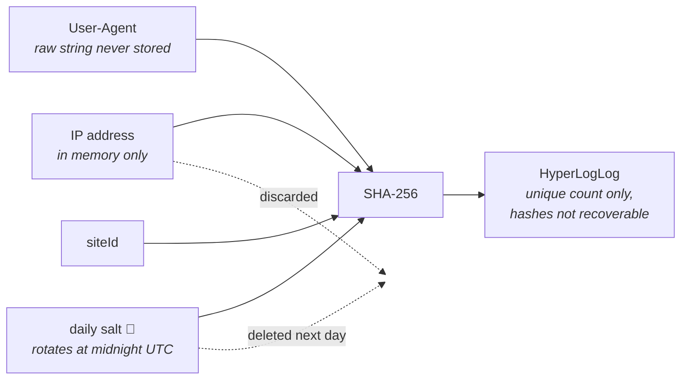

# Privacy Model

Effimero's core claim is that privacy comes from the algorithm, not from a policy document. This page explains exactly what happens to visitor data so you can verify the claim.

## The visitor hash

Every pageview computes, in memory, on the server:

```
visitorHash = SHA-256(IP | User-Agent | dailySalt | siteId)
```



- **IP**: taken from the connection (or `X-Forwarded-For` with `TRUST_PROXY=true`). Used for the hash and a GeoIP country lookup, then discarded. Never written to any log or store.
- **User-Agent**: used for the hash and parsed into coarse buckets (browser family, OS, device class). The raw string is never stored.
- **dailySalt**: 32 random bytes generated at first use each UTC day, held only in Redis with a TTL, never logged. Not derivable from the date. When the day ends the salt is gone.
- **siteId**: scopes the hash per site, so the same visitor on two Effimero-tracked sites produces unrelated hashes.

## Why the daily salt matters

A hash of IP + User-Agent alone would be a persistent pseudonymous identifier: anyone holding it could correlate a visitor across days, and rainbow tables over the IPv4 space would make it reversible. The daily salt breaks both attacks:

- Yesterday's hashes and today's hashes share no mathematical relationship.
- Reversing a hash requires the salt, which no longer exists after 24 hours.
- Even the operator cannot reconstruct a visitor's history. There is nothing to leak, sell, or subpoena.

This is the same reasoning [Plausible](https://plausible.io/data-policy) and the original [Margin blog post](https://inmargin.io/blog/tracking-unique-visitors-without-cookies) apply.

## What is stored, exactly

Per site and per UTC day, Redis holds only:

| Key | Structure | Content |
|---|---|---|
| `uniques` | HyperLogLog | Cardinality sketch of visitor hashes. Individual hashes are not recoverable from it. |
| `pageviews` | counter | A single integer |
| `paths`, `referrers` | hash of counters | `"/pricing" → 42`, `"google.com" → 17` |
| `browser`, `os`, `device`, `language`, `country` | hash of counters | `"Chrome" → 90`, `"IT" → 75` |
| `hours` | hash of counters | pageviews per hour 0-23 |
| `live:{bucket}` | HyperLogLog, TTL ≈ 7 min | live visitor sketch |

There is no event log. No row anywhere corresponds to one visitor or one visit.

## What is deliberately impossible

- **Returning visitors / retention curves**: identity does not survive midnight UTC.
- **Cross-site tracking**: the siteId in the hash isolates sites.
- **Session replay, funnels, user journeys**: no per-visitor data exists.
- **Reconstructing an individual's activity**, even with full database access.

## Client-side behavior

The snippet sets no cookie, writes nothing to localStorage or IndexedDB, and reads nothing device-specific (no canvas, fonts, or hardware probing). It sends only `siteId`, `path`, and `referrer`. It honors Do Not Track and Global Privacy Control by disabling itself entirely.

## Consent banners and GDPR

Effimero processes the IP transiently in memory, stores no personal data, and cannot single out an individual. Under the prevailing interpretation (matching CNIL guidance on exempt audience measurement and the practice of comparable tools) this does not require prior consent. That said, regulatory interpretations evolve and jurisdictions differ: verify with your own counsel. What Effimero guarantees is the technical side, which is that there is no stored personal data to disclose, export, or delete.

## Known accuracy trade-offs

- Visitors sharing IP and identical browser version within one day count as one.
- A visitor whose IP changes mid-day (mobile roaming) counts twice.
- HyperLogLog counts carry ~0.81% standard error.

These are the honest costs of not identifying people.
